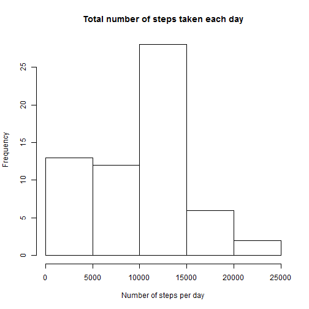
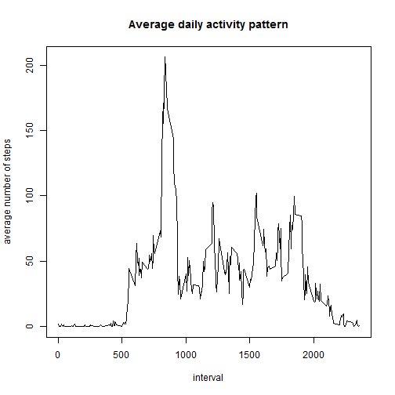
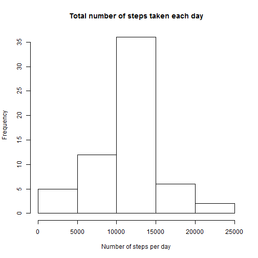
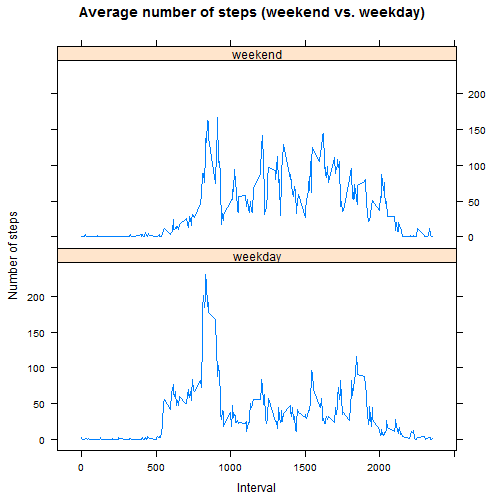

## Loading and preprocessing the data

First, we will load the data and convert date to POSIXlt:


```r
activity <- read.csv("activity.csv")
activity$datePOSIX <- as.POSIXlt(activity$date)
```


## What is mean total number of steps taken per day?

We calculate the total number of steps for each day (while omiting NA values) and plot the results as histogram:


```r
total_steps_per_day <- tapply(activity$steps, activity$date, sum, na.rm = TRUE)
hist(total_steps_per_day, xlab = "Number of steps per day", main = "Total number of steps taken each day")
```

 

**Mean** value of the total number of steps is:


```r
mean(total_steps_per_day, na.rm = T)
```

```
## [1] 9354.23
```
And **median** value is:

```r
median(total_steps_per_day, na.rm = T)
```

```
## [1] 10395
```


## What is the average daily activity pattern?

Now we compute average number of steps across all days for each 5-minute interval and plot it as a time series:


```r
intervals <- sort(unique(activity$interval))
average_daily_activity_pattern <- sapply(intervals, function(x) mean(activity[activity$interval == x, "steps"], na.rm = T))
plot(x = intervals, y = average_daily_activity_pattern, type = "l", xlab = "interval", ylab = "average number of steps", main = "Average daily activity pattern")
```

 

On average, maximum number of steps has this interval:

```r
intervals[which.max(average_daily_activity_pattern)]
```

```
## [1] 835
```

## Imputing missing values

Number of missing values in the dataset:

```r
sum(is.na(activity$steps))
```

```
## [1] 2304
```

Filling the missing values by the average across all days for each interval.
For this step, we create a new dataset **activity2**.
First, we find the indices of rows with missing values.
Then we take the average value for each such row by using the interval value:

```r
activity2 <- activity
which_have_missing_values <- which(is.na(activity2$steps))
activity2$steps[which_have_missing_values] <- round(average_daily_activity_pattern[match(activity2[which_have_missing_values, "interval"], intervals)])
```

New dataset in histogram of total number of steps taken each day:

```r
total_steps_per_day2 <- tapply(activity2$steps, activity2$date, sum)
hist(total_steps_per_day2, xlab = "Number of steps per day", main = "Total number of steps taken each day")
```

 

And new value of **mean** is:


```r
mean(total_steps_per_day2)
```

```
## [1] 10765.64
```
And **median** value is:

```r
median(total_steps_per_day2)
```

```
## [1] 10762
```

As we can see, these values are different (higher) from those calculated earlier.
The reason is that the **sum** function used 0 value for NA's in the first calculation whereas now they were non-zero.

## Are there differences in activity patterns between weekdays and weekends?

Now we take a look at weekdays and weekends.
First we load the lattice package and set the locale to English, so we can use day names such as Monday etc.
Then for each interval, we compute the average number of steps, individually for weekend and weekdays.
Finally, we plot the data.


```r
library(lattice)
Sys.setlocale("LC_TIME", "English")
```

```
## [1] "English_United States.1252"
```

```r
point_in_week <- ifelse(weekdays(activity2$datePOSIX, T) %in% c("Sat", "Sun"), "weekend", "weekday")

intervals <- sort(unique(activity2$interval))
average_daily_activity_pattern_weekend <- sapply(intervals, function(x) mean(activity2[activity2$interval == x & point_in_week == "weekend", "steps"]))
average_daily_activity_pattern_weekday <- sapply(intervals, function(x) mean(activity2[activity2$interval == x & point_in_week == "weekday", "steps"]))

aggregated_data <- data.frame(interval = c(intervals, intervals), pattern = c(average_daily_activity_pattern_weekend, average_daily_activity_pattern_weekday), week_point = c(rep("weekend", length(intervals)), rep("weekday", length(intervals))))

xyplot(pattern ~ interval | week_point, data = aggregated_data, type = "l", ylab = "Number of steps", xlab = "Interval",
       main = "Average number of steps (weekend vs. weekday)", layout = c(1, 2))
```

 
